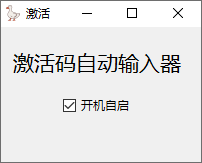
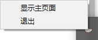

# activation_codes_filecxx

## 介绍

~~参考 [Uber-Eins/FileCentipede-Automatic-Activation: 一个简单的文件蜈蚣(半)自动激活程序](https://github.com/Uber-Eins/FileCentipede-Automatic-Activation) 完成的GUI版自动激活工具~~

activation_codes_filecxx 是一个功能强大的GUI版自动激活工具，参考了 Uber-Eins/FileCentipede-Automatic-Activation 的实现。它提供了一系列实用的功能，旨在简化激活过程并提升用户体验。

activation_codes_filecxx 为用户提供了一站式的自动激活解决方案，旨在简化用户的操作流程，提高效率。无论是在图形界面还是在命令行模式下，都能轻松实现激活，并且始终保持激活码列表的最新状态。

## 功能

1. 开机自启：程序可以设置为在系统启动时自动启动，确保自动激活功能始终可用。
2. 循环检测：程序可以定期检测系统状态，以确保自动激活功能正常运行。
3. 自动激活：程序参考了FileCentipede-Automatic-Activation的实现，并实现了类似的自动激活功能。
4. 命令行功能：程序可以通过命令行参数来控制启动选项、获取激活码、显示版本号等，提供更灵活的使用方式。
5. 启动自动更新激活码列表：程序可以在每次启动时自动检查并更新激活码列表，确保始终使用最新的激活码。

## 命令行程序

```
usage: File Centipede Automatic Activation.exe [-h] [-s] [-c] [-v] [-u] [-f]

文件蜈蚣自动激活器

optional arguments:
  -h, --help     show this help message and exit

命令行参数:
  -s, --startup  开机自启
  -c, --code     获取激活码
  -v, --version  版本号

更新参数:
  -u, --update   更新激活码列表
  -f, --force    强制更新激活码列表

直接运行程序以显示用户界面
```

## 截图



